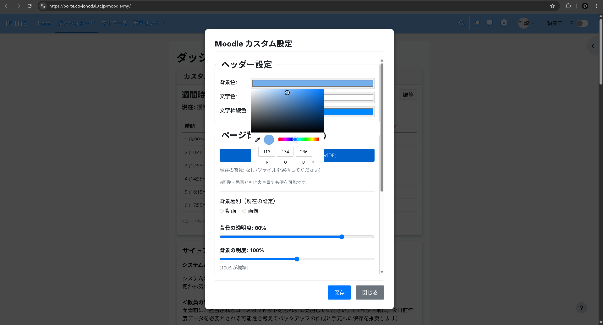
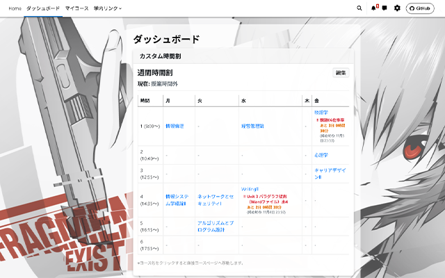
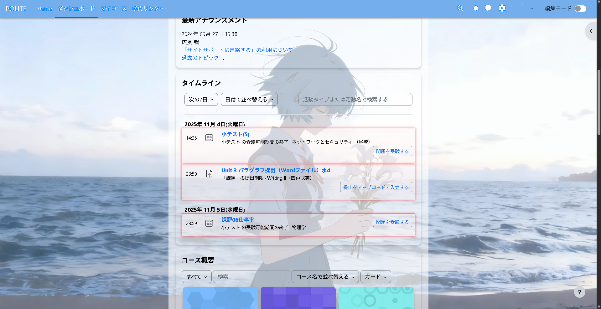
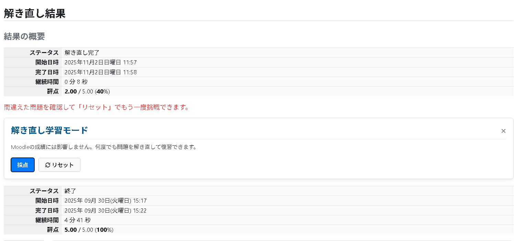
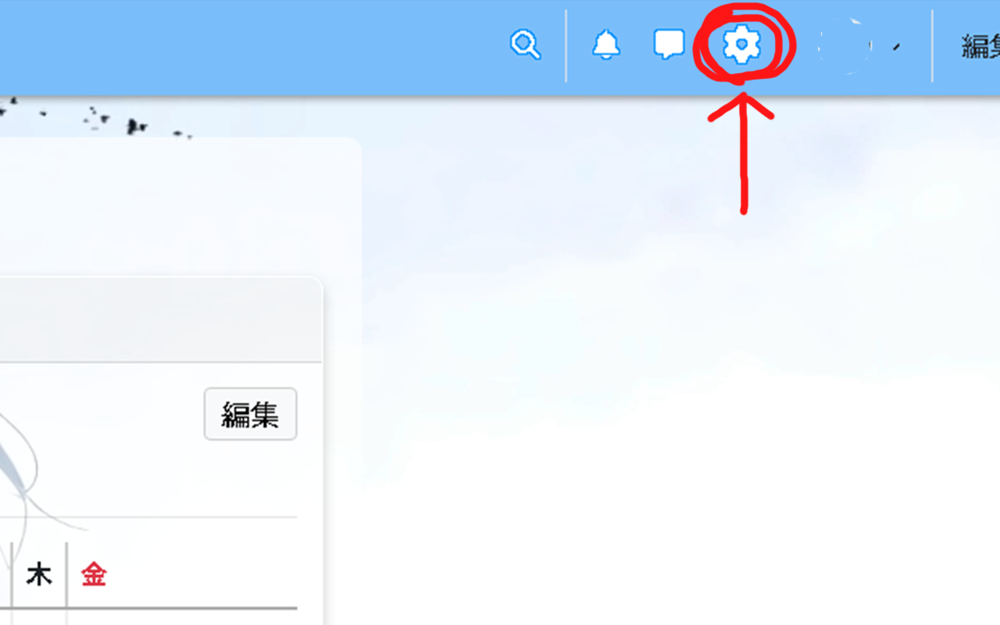

# Moodle-Custom-Extension (POLITE)

北海道情報大学のMoodle (POLITE) の見た目をカスタマイズし、便利なウィジェットを追加するChrome拡張機能です。

---

# 主な機能

* **背景のカスタマイズ**
    * ページの背景に好きな画像や動画（ローカルファイル）を設定
    * 背景の透明度や明るさの調整
    

      
       
      <em>動画背景の設定デモ</em>
    

* **ヘッダーのカスタマイズ**
    * ヘッダーの背景色、文字色のカスタマイズ
    

      
       
      <em>ヘッダー設定画面</em>
    

* **カスタム時間割**
    * ダッシュボードへのカスタム時間割ウィジェットの追加・編集
    

      
       
      <em>カスタム時間割の表示例</em>
    

* **コンテンツブロックの透明度調整**
* **課題締め切りの強調**
    

      
       
      <em>締め切りが近い課題の強調表示</em>
    

* **解き直しモード**
    

      
       
      <em>解き直しモードの表示例</em>
    

---

# 使い方 (インストール方法)
## 推奨: Chromeウェブストアからインストール

以下のリンクから直接インストールできます。

https://chromewebstore.google.com/detail/plihohicbpnimfimobapbjeebebabjja?utm_source=item-share-cb

## 手動でインストール
1.  このリポジトリの `dist` フォルダを丸ごとダウンロードします。
2.  Chromeブラウザで、アドレスバーに `chrome://extensions` と入力して開きます。
3.  右上の「**デベロッパー モード**」をオンにします。
4.  「**パッケージ化されていない拡張機能を読み込む**」ボタンをクリックします。
5.  ダウンロードした `dist` フォルダを選択します。
6.  ヘッダー部分に設定（歯車アイコン）が追加されます。
    

      
       
      <em>ヘッダーに追加された設定アイコン</em>
    

---

## 免責事項

* この拡張機能は、開発者（maiaka）が**非公式**に開発したものです。**北海道情報大学とは一切関係ありません。**
* 本拡張機能の利用により何らかの不具合や問題が発生した場合でも、開発者は一切の責任を負いません。
* **すべて自己責任**においてご利用ください。

---

##  バグ報告・機能要望

エラーの報告や「こんな機能が欲しい」といった要望は、以下のメールアドレスまでご連絡ください！

* **Email:** <lqianye03@gmail.com>

## バージョン情報

### v1.0
* 初回リリース

### v2.0
* 解き直しモードを追加

### v2.1
* 時間割に締め切りを表示
* ウィンドウを小さくしたときのヘッダーのuiの崩れを修正
* 透明度調整の範囲を修正
---

## 開発者

* maiaka

---

## ライセンス

Copyright (c) 2025 Miaka1020. All Rights Reserved.

本拡張機能のソースコードやデザインの改変、および二次配布（再配布）は固く禁止します。
